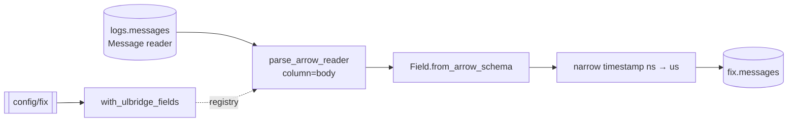

# Parse FIX

Streams every row in `logs.messages` through Yggdryl's native FIX codec and
merges the result into [`fix.messages`](../../products/fix-message.md).

```bash
rekep task run tasks/parse_fix/parse_fix.json
```

```json
{
  "parameters": {
    "registry": "file:config/fix",
    "branch": "ulbridge",
    "version": null,
    "dedup": false
  }
}
```

| parameter | contract |
| --- | --- |
| `registry` | dictionary URI; `null` selects `YGGDRYL_FIX_REGISTRY` |
| `branch` | dialect used to resolve ULBridge names before standard FIX names |
| `version` | optional FIX version at which values are read; `null` lets each row answer |
| `dedup` | drop only an output whose message digest equals the previous emitted row |
| `catalog` | the PyIceberg catalog containing both tables |

## One codec pass



There is no `msgtype` filter and no carrier-column rename. The codec receives
the stored `Message` reader directly. It reads FIX, ULLINK, and bridge forms
from `body`; a prose or empty body still becomes one stamped output row. With
the default `dedup=false`, 111 input lines produce 111 output rows.

The call is the complete protocol boundary:

```python
from yggdryl.fix import parse_arrow_reader

parsed = parse_arrow_reader(
    messages,
    registry,
    "body",
    branch="ulbridge",
    version=None,
    dedup=False,
)
```

## Registry

Every `FixRegistry` is born with Yggdryl's 16 crate fields. The task rejects a
location containing only those seeded fields, then calls
`with_ulbridge_fields()` to add the bridge vocabulary. No compatibility call
or second registry exists in rekep.

`registry` is bound with `IOBase.from_uri`, so it accepts the same local and
remote URI forms as `filesystem`. Registry types determine the live output
schema. The checked JSON is a review snapshot, not parser authority.

## Carrier columns and fills

The codec keeps source columns first unless a fixed column claims the same
folded name. For the `Message` contract:

| source fact | result |
| --- | --- |
| `url`, `rownum`, `timepartition`, `threadId`, `sessionUid`, `seqNum`, `plugin`, `level`, `bodyhash`, `body` | retained as the first ten columns |
| `timestamp` | stamps fixed `timestamp`; not duplicated |
| `msgCtxId` | fills fixed `msgctxid`; not duplicated |
| `seqNum` | also fills `msgseqnum` when the frame does not state tag 34 |
| `plugin` | also fills the sender or target plugin session according to direction |

`bodyhash` remains separate from `msghash`. The first identifies exact source
bytes; the second is the codec-owned digest over `nofixentries` with the
session envelope excluded.

## Output contract

The checked registry and raw carrier produce 108 columns:

| count | columns |
| ---: | --- |
| 10 | retained source columns |
| 80 | standard projected FIX fields |
| 16 | Yggdryl crate fields, tags `65000` through `65015` |
| 2 | `nofixentries` and `nounmappedfixentries` |

Fixed columns use folded canonical names such as `msgtype`, `sendingtime`, and
`orderqty`. Their numeric tags remain in `fix:tag` metadata; there is no
numeric-name schema and no snake-case alias layer.

Four codec columns are non-null for every row:

| column | fallback when the body states none |
| --- | --- |
| `beginstring` | resolved version, ultimately FIX 4.4 |
| `msghash` | digest of the possibly empty parsed arrival record |
| `timestamp` | source row clock, else a message clock, else Unix epoch |
| `unixpartition` | partition derived from `timestamp` |

All other fixed columns are nullable. `nofixentries` preserves every parsed
pair in arrival order; `nounmappedfixentries` is the subset no registry field
explained.

## Iceberg precision and evolution

Yggdryl can type venue clocks at nanoseconds. Iceberg v2 cannot store that
unit, including inside a repeating group. The task recursively declares every
`timestamp[ns]` as `timestamp[us]`, then applies that field once with strict
nullability. Wire text remains in `nofixentries`.

`fix.messages` is opened with `merge_schema=True`, so a selected registry can
add nullable output columns before data is consumed. Existing column types,
ids, keys, and partition rules are never rewritten implicitly.

## Replay

The codec output keeps `(url, rownum)` and the hourly `timepartition` marker.
A replay reads every stored message, writes none, and creates no snapshot.
