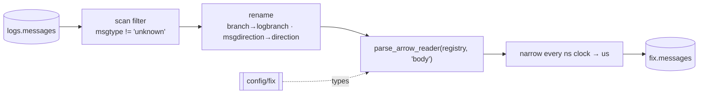

# Parse FIX

Streams the classified rows of `logs.messages` through the native FIX reader
and merges the result into [`fix.messages`](../../products/fix-message.md).

```bash
rekep task run tasks/parse_fix/parse_fix.json
```

```json
{
  "parameters": {
    "registry": "file:config/fix",
    "version": "FIX.4.4",
    "dedup": true
  }
}
```

| parameter | what it names |
| --- | --- |
| `registry` | the dictionary; `null` selects the process registry (`YGGDRYL_FIX_REGISTRY`) |
| `version` | the version built messages are expressed in |
| `dedup` | drop a record whose digest repeats the previous emitted one's |
| `catalog` | the PyIceberg catalog to write into |

## The pass



## The dictionary

`registry` is bound through `IOBase.from_uri`, so it accepts a relative `file:`
path, an absolute one, or `s3://example-bucket/config/fix?region=eu-west-1`. An
empty registry is refused before `fix.messages` is created.

The task then calls `with_crate_fields`, registering the seven derived facts on
their own branch, so no standard tag is claimed. The registry types the table:
it must stay the same for the life of `fix.messages`, and changing it is an
explicit table-schema migration rather than implicit evolution during
ingestion.

### Nanoseconds

A venue stamps nanoseconds and the reader reads them; Iceberg v2 has no
nanosecond timestamp and refuses one outright. So every nanosecond clock in the
parser's schema -- the dictionary's own, the derived market clock, and any
clock nested inside a repeating group -- is declared at microseconds, and the
native apply narrows it once in the cast it already runs.

```python
import pyarrow


def microseconds(dtype):
    """One Arrow type with every nanosecond clock in it narrowed."""
    if pyarrow.types.is_timestamp(dtype) and dtype.unit == "ns":
        return pyarrow.timestamp("us", tz=dtype.tz)
    if pyarrow.types.is_list(dtype):
        item = dtype.field(0)
        return pyarrow.list_(item.with_type(microseconds(item.type)))
    if pyarrow.types.is_struct(dtype):
        return pyarrow.struct([m.with_type(microseconds(m.type)) for m in dtype])
    return dtype


assert microseconds(pyarrow.timestamp("ns", tz="UTC")) == pyarrow.timestamp("us", tz="UTC")
```

It is a stated loss, not a hidden one: `entries` keeps the wire text of every
pair, so what a venue actually stamped is still in the row.

## What it reads

`logs.messages` under `msgtype != 'unknown'`, pushed into scan planning. A
record the raw layer could not name a `MsgType` for carries no FIX frame, so it
stays where it is rather than becoming a row of nulls here. The classification
is read, never recomputed.

### The two renamed columns

The reader reads five of a capture's own columns as per-row parameters, and two
of the raw contract's names land on them:

| raw column | carried as | why |
| --- | --- | --- |
| `branch` | `logbranch` | on a raw record this is the driver that printed the line, not a FIX dialect; left alone it would pin every row to a dialect nobody declared |
| `msgdirection` | `direction` | this *is* the parameter, so the reader uses the direction already read instead of reading it again |

The rename is what makes column `385` equal the raw layer's own reading rather
than a second, independent one. [Decode](../../fix/decode.md) lists all five
parameter columns.

## What it writes

101 columns: the raw record, 87 named by tag, and `entries`/`unmapped`. One
input row is one output row -- prose, an unreadable frame and an empty body
included -- so `url` and `rownum` still identify the result. `dedup` is the one
exception and says so.

The output schema is available before the first batch: the application builds
its `Field` with `Field.from_arrow_schema`, applies it to the reader, and hands
the stream to Iceberg. No FIX parser, registry, or row model of rekep's own
exists. [Decode](../../fix/decode.md) states the frame location, the separator
spellings and the typing rules in full.

### Derived columns

| column | contract |
| --- | --- |
| `30001` | `fixed_size_binary[16]`, XXH3-128 over the parsed message |
| `30002` | the FIX version the row was read as |
| `30003` | the cross-venue ticker |
| `30004` | the market clock: the first clock the message answers, in microseconds |
| `30005` | `int64`, the partition that clock falls in |
| `30006`, `30007` | the two parent order identifiers |

`msghash` is separate and comes from the raw layer: it digests the exact body
bytes rather than the parsed message. [Quality](../../fix/quality.md) says when
each one is the right key.

## Deduplication and standardization

`dedup` drops a record whose digest repeats the previous emitted record's. It
is sequential rather than global, which removes a retransmitted order or a
repeated heartbeat without collapsing two genuine events. Switching it on
surrenders the row-in/row-out correspondence: the output no longer aligns with
the input by position, and what went is counted rather than silent.

`version` is the version built messages are expressed in. A capture spans
dialects -- one session writes `FIX.4.2`, another `FIX.4.4` -- and declaring one
resolves every row against the same field lineage whatever it arrived as.
Column `30002` records what each row was actually read as, so the
standardization never hides what the wire said.

## Replay

```text
first run    4 read, 4 written, 0 skipped
replay       4 read, 0 written, 4 skipped   → no data file, no snapshot
```

`fix.messages` keeps the source `(url, rownum)` key and the source
`timepartition` hourly declaration. The
[checked snapshot](../../products/fix-message.md) is the 101-column schema this
checkout's dictionary generates; the runtime registry stays authoritative.
