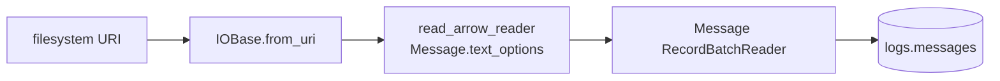

# Parse messages

Reads physical ULBridge text lines and merges raw `Message` rows into
[`logs.messages`](../../products/message.md). Protocol parsing belongs to
[`parse_fix`](parse-fix.md).

```bash
rekep task run tasks/parse_messages/parse_messages.json
```

```json
{
  "parameters": {
    "filesystem": "file:data/capture"
  }
}
```

| parameter | contract |
| --- | --- |
| `filesystem` | one file, directory, or object prefix accepted by `IOBase.from_uri` |
| `catalog` | the PyIceberg catalog containing `logs.messages` |

There is no direction, classifier, or FIX registry parameter. This stage does
not inspect `body`.

## Native text pass



`Message.text_options()` supplies the complete read contract:

| option | value |
| --- | --- |
| row numbering | starts at 1 |
| modification-time parsing | disabled |
| row header | exact ULBridge header expression |
| timezone | UTC |
| cast safety | unsafe where the declared native cast permits it |
| output field | `Message.field()` |

The native text reader therefore returns the final 12-column schema. It types
the captured integers and timestamp, derives `timepartition`, fills
`bodyhash`, and checks strict nullability before yielding each batch. The task
does not transform rows or reapply the field in Python.

## Header captures

The accepted prefix is:

```text
timestamp [threadId-sessionUid:msgCtxId:seqNum] [plugin] (level) body
```

The session/context/sequence suffix is optional as one group. A matched header
fills `timestamp`, `threadId`, `sessionUid`, `msgCtxId`, `seqNum`, `plugin`, and
`level`; `body` starts after the trailing space. A line without that prefix is
still one row: its captures are null and its full bytes are `body`.

`bodyhash` is XXH3-128 over those exact body bytes. It is deliberately named
apart from the FIX codec's `msghash`, which digests the parsed arrival record.

## Streaming and identity

The task passes one schema-bearing `RecordBatchReader` to Iceberg. `IOBase`
opens one leaf at a time, preserves injected filesystems and opaque paths, and
streams supported compression without staging remote objects locally.

`(url, rownum)` is the primary key. A replay therefore has this shape:

```text
first run   111 read, 111 written,   0 skipped
replay      111 read,   0 written, 111 skipped
```

One record is not byte-bounded until Yggdryl can reject an overflow without
changing its exact body. Transport and row batches remain bounded.

## Compressed input

| input | status |
| --- | --- |
| single-member gzip and zstd | streamed |
| concatenated zstd frames | read in order |
| concatenated gzip members | needs a [decoder fix](../../roadmap/text-streaming.md#concatenated-members); staging locally is not a substitute |

## Benchmark

```bash
cd python
uv run python benchmarks/bench_message.py
```

The measured record and its host assumptions live on the single
[benchmark page](../../storage/benchmarks.md).
