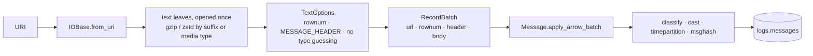

# Parse messages

Reads physical text records recursively and merges raw `Message` rows into
[`logs.messages`](../../products/message.md). It leaves `body` uninterpreted --
[`parse_fix`](parse-fix.md) owns the protocol pass.

```bash
rekep task run tasks/parse_messages/parse_messages.json
```

```json
{
  "parameters": {
    "filesystem": "file:data/capture",
    "direction": "sent"
  }
}
```

| parameter | what it names |
| --- | --- |
| `filesystem` | one URI: a file, a directory, or `s3://bucket/prefix?region=…` |
| `direction` | what a line carrying no verb took: `sent`, `recv`, `unknown` |
| `catalog` | the PyIceberg catalog to write into |

There is no `registry`: classification reads the frame's own shape, so this
stage needs no dictionary.

## The pass



| step | contract |
| --- | --- |
| bind | the URI reaches `IOBase.from_uri` unchanged; no remote object is staged locally |
| read | 1 MiB transport read-ahead, batches of 65,536 rows |
| capture | the fixed `rekep.times.MESSAGE_HEADER` expression; the second bracket is `branch` |
| type | inference off -- header captures stay text, the body stays bytes |
| clock | offset-free means UTC; fractions padded or truncated to microseconds; a missing header stays null; an invalid instant fails the batch |
| write | one schema-bearing `RecordBatchReader`, merged on `(url, rownum)` |

Neither boundary accumulates the source or an output table in memory. One
individual record is bounded only when `TextOptions.max_record_byte_size` is
set; its truncation policy would change `body`, so this task leaves it unset.

## Classification and digest

Four columns are added beside the capture, and none interprets the body:

| column | from |
| --- | --- |
| `mimetype` | the frame's own shape |
| `msgtype` | the `MsgType` the frame spells, else `unknown` |
| `msgdirection` | the verbs beside the frame, else the `direction` parameter |
| `msghash` | XXH3-128 over the exact body bytes |

The first three are one `classify_arrow_array` pass over the payload column, so
no row crosses into Python. `parse_fix` reads that classification rather than
recomputing it; [Quality](../../fix/quality.md) states what each value means.

## Replay

```text
first run   14 read, 14 written,  0 skipped
replay      14 read,  0 written, 14 skipped   → no data file, no snapshot
```

## Compressed input

| input | status |
| --- | --- |
| single-member gzip, zstd | streams |
| concatenated zstd frames | read in order |
| concatenated gzip members | needs a decoder fix; staging locally is not a substitute |

## Throughput

```bash
cd python
uv run python benchmarks/bench_message.py
```

Numbers are in the single [benchmark record](../../storage/benchmarks.md). The
sequential text path already has encoded transport read-ahead, the positional
`buffered()` cache is not used by record reads, and a local-staging diagnostic
was slower -- so remote objects stay direct streams.
