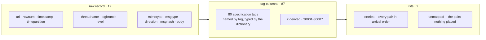

# fix.messages

One row is one FIX frame, read from a `logs.messages` body. The schema is a
fixed projection of tags -- not a column per dictionary definition -- so a
six-thousand-field dictionary is still a 101-column table, and every pair the
projection does not name is kept in `entries`.



| property | value |
| --- | --- |
| columns | 101 |
| primary key | `(url, rownum)` |
| partition | `timepartition`, Iceberg `hour` transform |
| every clock | `timestamp[us, UTC]` |
| written by | [`parse_fix`](../pipeline/tasks/parse-fix.md) |

## The raw record it carries forward

The twelve [`logs.messages`](message.md) columns arrive unchanged except for
two renames, so the FIX row still identifies the line it came from.

| column | type | note |
| --- | --- | --- |
| `url`, `rownum` | `string`, `int64` | primary key, unchanged |
| `timestamp`, `timepartition` | `timestamp[us, UTC]` | the capture's clock, not the market's |
| `threadname`, `level` | `string` | header captures |
| `logbranch` | `string` | the raw `branch`, renamed out of the dialect parameter |
| `mimetype`, `msgtype` | `string` | the reading `parse_messages` already made |
| `direction` | `string` | the raw `msgdirection`, renamed *into* the reader's parameter |
| `msghash` | `fixed_size_binary[16]` | digest of the body bytes |
| `body` | `binary` | the exact bytes that were parsed |

## The 87 tag columns

Columns are named by tag, because a tag is the one name a field keeps across
every version and dialect. The dictionary types them; the
[registry browser](../fix/registry.md#browse-the-dictionary) opens any of them.

??? note "Session and envelope (28)"
    | tag | field | type |
    | --- | --- | --- |
    | `8` | BeginString | `string` |
    | `9` | BodyLength | `int32` |
    | `35` | MsgType | `fixed_size_binary[8]` |
    | `385` | MsgDirection | `fixed_size_binary[4]` |
    | `49` | SenderCompID | `string` |
    | `56` | TargetCompID | `string` |
    | `50` | SenderSubID | `string` |
    | `142` | SenderLocationID | `string` |
    | `57` | TargetSubID | `string` |
    | `143` | TargetLocationID | `string` |
    | `115` | OnBehalfOfCompID | `string` |
    | `116` | OnBehalfOfSubID | `string` |
    | `144` | OnBehalfOfLocationID | `string` |
    | `128` | DeliverToCompID | `string` |
    | `129` | DeliverToSubID | `string` |
    | `145` | DeliverToLocationID | `string` |
    | `34` | MsgSeqNum | `int64` |
    | `43` | PossDupFlag | `bool` |
    | `97` | PossResend | `bool` |
    | `52` | SendingTime | `timestamp[us, tz=UTC]` |
    | `122` | OrigSendingTime | `timestamp[us, tz=UTC]` |
    | `90` | SecureDataLen | `int32` |
    | `91` | SecureData | `binary` |
    | `212` | XmlDataLen | `int32` |
    | `213` | XmlData | `binary` |
    | `93` | SignatureLength | `int32` |
    | `89` | Signature | `binary` |
    | `10` | CheckSum | `string` |

??? note "Identifiers (11)"
    | tag | field | type |
    | --- | --- | --- |
    | `1` | Account | `string` |
    | `11` | ClOrdID | `string` |
    | `41` | OrigClOrdID | `string` |
    | `526` | SecondaryClOrdID | `string` |
    | `37` | OrderID | `string` |
    | `198` | SecondaryOrderID | `string` |
    | `17` | ExecID | `string` |
    | `1003` | TradeID | `string` |
    | `131` | QuoteReqID | `string` |
    | `117` | QuoteID | `string` |
    | `693` | QuoteRespID | `string` |

??? note "Instrument (10)"
    | tag | field | type |
    | --- | --- | --- |
    | `55` | Symbol | `string` |
    | `48` | SecurityID | `string` |
    | `22` | SecurityIDSource | `string` |
    | `454` | NoSecurityAltID | `list<item: struct<securityaltid: string, securityaltidsource: string, symbolpositionnumber: int32> not null>` |
    | `167` | SecurityType | `string` |
    | `762` | SecuritySubType | `string` |
    | `207` | SecurityExchange | `fixed_size_binary[4]` |
    | `461` | CFICode | `string` |
    | `541` | MaturityDate | `date32[day]` |
    | `460` | Product | `int32` |

??? note "Order, price and quantity (17)"
    | tag | field | type |
    | --- | --- | --- |
    | `54` | Side | `fixed_size_binary[4]` |
    | `40` | OrdType | `string` |
    | `44` | Price | `double` |
    | `38` | OrderQty | `double` |
    | `53` | Quantity | `double` |
    | `854` | QtyType | `int32` |
    | `15` | Currency | `fixed_size_binary[3]` |
    | `120` | SettlCurrency | `fixed_size_binary[3]` |
    | `132` | BidPx | `double` |
    | `133` | OfferPx | `double` |
    | `134` | BidSize | `double` |
    | `135` | OfferSize | `double` |
    | `31` | LastPx | `double` |
    | `32` | LastQty | `double` |
    | `6` | AvgPx | `double` |
    | `14` | CumQty | `double` |
    | `151` | LeavesQty | `double` |

??? note "State and reasons (8)"
    | tag | field | type |
    | --- | --- | --- |
    | `39` | OrdStatus | `string` |
    | `150` | ExecType | `string` |
    | `297` | QuoteStatus | `int32` |
    | `301` | QuoteResponseLevel | `int32` |
    | `368` | QuoteEntryRejectReason | `int32` |
    | `103` | OrdRejReason | `int32` |
    | `102` | CxlRejReason | `int32` |
    | `58` | Text | `string` |

??? note "Clocks (5)"
    | tag | field | type |
    | --- | --- | --- |
    | `60` | TransactTime | `timestamp[us, tz=UTC]` |
    | `64` | SettlDate | `date32[day]` |
    | `75` | TradeDate | `date32[day]` |
    | `126` | ExpireTime | `timestamp[us, tz=UTC]` |
    | `768` | NoTrdRegTimestamps | `list<item: struct<trdregtimestamp: timestamp[us, tz=UTC], trdregtimestamptype: int32, trdregtimestamporigin: string, trdregtimestampmanualindicator: bool, desktype: string, desktypesource: int32, deskorderhandlinginst: string, informationbarrierid: string, nbboentrytype: int32, nbboprice: double, nbboqty: double, nbbosource: int32> not null>` |

??? note "Parties (1)"
    | tag | field | type |
    | --- | --- | --- |
    | `453` | NoPartyIDs | `list<item: struct<partyid: string, partyidsource: string, partyrole: int32, partyrolequalifier: int32> not null>` |

### Derived, on their own branch

Seven facts no standard tag names, computed from the message:

| tag | column | type | what it is |
| --- | --- | --- | --- |
| `30001` | `msghash` | `fixed_size_binary[16]` | XXH3-128 over the entries in arrival order |
| `30002` | `version` | `string` | the version the row was read as |
| `30003` | `symbolticker` | `string` | the cross-venue ticker |
| `30004` | `timestamp` | `timestamp[us, UTC]` | the market clock: the first clock the message answers |
| `30005` | `unixpartition` | `int64` | the partition that clock falls in |
| `30006` | `parentclordid` | `string` | parent `ClOrdID` |
| `30007` | `parentorderid` | `string` | parent `OrderID` |

`30001` digests the *parsed* message; `msghash` beside it digests the raw
bytes. [Quality](../fix/quality.md) says when each is the right key.

### The two lists

```text
entries  : list<struct<tag: int32, branch: string, key: string, value: string>>
unmapped : list<struct<tag: int32, branch: string, key: string, value: string>>
```

`entries` is every wire pair in arrival order -- the lossless record, and what
[re-encoding](../fix/encode.md) reads. `unmapped` is the subset nothing placed:
the coverage metric, and the work list for
[adding a definition](../fix/registry.md#adding-a-definition).

## Read the contract

```python
import pathlib

from yggdryl import Field

field = Field.from_json(pathlib.Path("schemas/rekep/fix-message.json").read_text())
schema = field.into_arrow_schema()

assert len(schema) == 101
assert schema.field("30004").type.unit == "us"
assert str(schema.field("453").type).startswith("list<item: struct<partyid:")
assert schema.names[-2:] == ["entries", "unmapped"]
```

The file is a snapshot for review and schema-only tests. The runtime registry
is the authority: `parse_fix` asks it for the schema before it reads a batch,
so a dictionary that types a tag differently is a differently typed table with
no code change.
