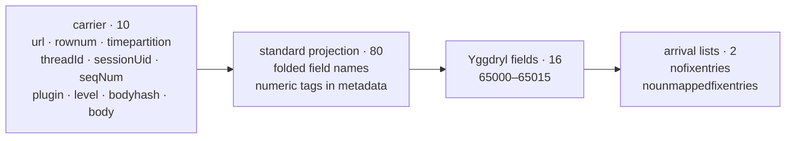

# fix.messages

One row is one Yggdryl FIX-codec result for a stored `Message`. Every input row
produces an output row unless `dedup` is enabled, so prose and unreadable bodies
remain visible instead of disappearing before the protocol boundary.

## Shape

The checked registry produces 108 columns:



| property | value |
| --- | --- |
| columns | 108 |
| primary key | `(url, rownum)` |
| partition | `timepartition`, Iceberg hour transform |
| timestamp storage | `timestamp[us, UTC]` |
| schema authority | runtime `FixRegistry` |
| checked snapshot | `schemas/rekep/fix-message.json` |

## Carrier behavior

Ten raw columns lead the row. Raw `timestamp` and `msgCtxId` do not appear a
second time: folded-name matching lets them fill fixed `timestamp` and
`msgctxid`. `seqNum` also fills `msgseqnum` when tag 34 is absent, while the
original `seqNum` carrier remains. `plugin` can fill the sender or target plugin
session according to the direction read from the body.

The two hashes are intentionally distinct:

| column | identity |
| --- | --- |
| `bodyhash` | XXH3-128 over exact captured `body` bytes; carried from `logs.messages` |
| `msghash` | XXH3-128 over `nofixentries` with the session envelope excluded; built by the codec |

## Fixed names and tags

Every projected field uses its folded canonical name: `msgtype`, not `35` or
`msg_type`; `sendingtime`, not `52`. The tag remains authoritative metadata.

```python
from pathlib import Path

from yggdryl import Field

field = Field.from_json(Path("schemas/rekep/fix-message.json").read_text())
schema = field.into_arrow_schema()

assert len(schema) == 108
assert "35" not in schema.names
assert schema.field("msgtype").metadata[b"fix:tag"] == b"35"
assert schema.names[-2:] == ["nofixentries", "nounmappedfixentries"]
```

The 80 standard fields cover the session envelope, identifiers, instruments,
orders, prices, quantities, clocks, state, three repeating groups, signature,
and checksum. The JSON snapshot is the exact column-by-column reference.

## Yggdryl fields

Every registry contains these 16 fields on the standard branch above
venue-published tags:

| tag | column | contract |
| ---: | --- | --- |
| 65000 | `msghash` | parsed-message digest |
| 65001 | `version` | version used to read the row |
| 65002 | `symbolticker` | normalized cross-venue ticker |
| 65003 | `timestamp` | source clock, then message clock, then epoch |
| 65004 | `unixpartition` | whole-second partition of `timestamp` |
| 65005 | `parentclordid` | parent client order id |
| 65006 | `parentorderid` | parent venue order id |
| 65007 | `sessionid` | session named by the message |
| 65008 | `msgctxid` | bridge message context |
| 65009 | `senderpluginid` | source plugin id |
| 65010 | `targetpluginid` | destination plugin id |
| 65011 | `senderpluginsession` | source plugin session |
| 65012 | `targetpluginsession` | destination plugin session |
| 65013 | `isincode` | resolved ISIN |
| 65014 | `miccode` | resolved ISO 10383 MIC |
| 65015 | `state` | normalized order lifecycle state |

`msgdirection` is the folded standard field for tag 385 and follows this block
in the fixed projection.

## Required stamps

The codec guarantees four non-null columns for every row:

| column | source order |
| --- | --- |
| `beginstring` | body, selected version, branch/default registry version, FIX 4.4 |
| `msghash` | parsed arrival record, including an empty one |
| `timestamp` | source `timestamp`, message clocks, Unix epoch |
| `unixpartition` | derived from `timestamp` |

Every other fixed field is nullable. This guarantee is why non-FIX prose can
remain in the same positional stream without violating the schema.

## Arrival record

```text
nofixentries         list<fixentry>  every parsed pair in arrival order
nounmappedfixentries list<fixentry>  pairs no registry field explained
```

The first list is the lossless protocol record and the source for re-encoding.
The second is the dictionary-coverage work list. Scalar type failures remain
null in their typed column while the original text stays in `nofixentries`.

## Runtime authority

The JSON file is generated from an empty `Message` reader through the selected
registry and codec, then narrowed from nanosecond to microsecond timestamps for
Iceberg v2. At runtime `parse_fix` derives the same field from the live reader
schema with `Field.from_arrow_schema`; registry changes therefore remain
explicit schema changes rather than hidden parser behavior.
