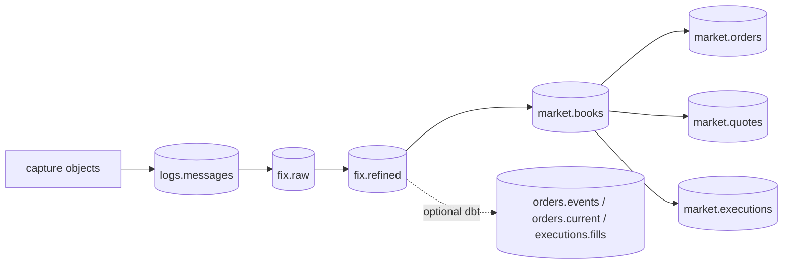

# Data products

rekep publishes seven Iceberg tables under four runtime-derived shapes.
Native market products start from `fix.refined`; they do not reparse captures
or repeat lifecycle processing. Existing dbt products remain optional.



| product | row grain | native key | runtime shape |
| --- | --- | --- | --- |
| [`logs.messages`](message.md) | physical source line | `curruuid` | Message |
| [`fix.raw`](fixmsg.md) | parsed event | `curruuid` | FixMsg |
| [`fix.refined`](fixmsg.md) | lifecycle event | `curruuid` | FixMsg |
| [`market.books`](../pipeline/tasks/parse-books.md) | symbol and effective book instant | `curruuid` | Book |
| [`market.orders`](../pipeline/tasks/parse-orders.md) | order mutation in book deltas | `curruuid` | MarketEvent |
| [`market.quotes`](../pipeline/tasks/parse-quotes.md) | quote mutation in book deltas | `curruuid` | MarketEvent |
| [`market.executions`](../pipeline/tasks/parse-executions.md) | execution leaf | `curruuid` | MarketEvent |

All are partitioned by the hour of `currunix`. The four [portable contracts](../contracts/index.md)
record their native-derived Iceberg declarations. Price and quantity remain
exact decimals; native UUIDs become fixed bytes, uint64 codes become signed
bit views and timestamps narrow to Iceberg v2 microseconds.

Books contain persistent `live` depth, per-emission `deltas`, and execution
leaves. Flat order/quote products use deltas; unchanged live members are not
new events. Native code already decomposes AE trade sides into executions.
Book input is strictly the requested window and starts without pre-window
depth, so this product is not a historical checkpoint reconstruction.

The three flat stages read one pinned book snapshot. Market writes atomically
replace exactly the requested window, including empty reruns; records outside
it survive. Native `curruuid` stays the event key even when a rerun changes
which events belong in the window.

Only `logs.messages` keeps `body`. FIX provenance follows `srcuuids` back to
those lines. The [optional dbt build](../pipeline/tasks/build-dbt.md) retains
its existing model-owned contracts for `orders.events`, `orders.current` and
`executions.fills`; these are separate from the native `market.*` products.

## Read products

```python
from rekep.iceberg import IcebergCatalog

store = IcebergCatalog.from_dict(
    {
        "name": "rekep",
        "properties": {
            "type": "sql",
            "uri": "sqlite:///data/catalog.db",
            "warehouse": "data/warehouse",
        },
    }
)
messages = store.dataset("logs.messages").read_arrow_table()
fixed = store.dataset("fix.refined").read_arrow_table()
store.close()
```

## Join and audit

```python
import pyarrow
import pyarrow.compute

audit = fixed.select(["curruuid", "srcuuids"])
parents = pyarrow.compute.list_parent_indices(audit.column("srcuuids"))
audit = pyarrow.table(
    {
        "fixuuid": pyarrow.compute.take(audit.column("curruuid"), parents),
        "lineuuid": pyarrow.compute.list_flatten(audit.column("srcuuids")),
    }
)
lines = messages.select(
    ["curruuid", "crosscode", "seqnum", "currhashcode"]
).rename_columns(
    ["lineuuid", "crosscode", "seqnum", "currhashcode"]
)
joined = audit.join(lines, keys="lineuuid", join_type="left outer")

assert joined.num_rows == pyarrow.compute.sum(
    pyarrow.compute.list_value_length(fixed.column("srcuuids"))
).as_py()
assert joined.column("currhashcode").null_count == 0
```

The audit projects before it joins: a join carries no map or list column, and
a FIX row has both -- `srcuuids` among them, which is why its entries are
flattened to one provenance row each. The join is exact provenance rather than
a recomputation: `srcuuids` contains identities the text read stamped on
lines, carried through the parse and moved by no walk. The object a line was
read from, its row number and its text come only from the joined text row:
its `crosscode`, `seqnum` and `body`.

The line's `currhashcode` digests its object, its header's captures except
the clock, its row number and its body. Text and FIX rows both use a column
named `curruuid` as their sole key, but at different grains: the text row's
value identifies the line, while a FIX value identifies the settled event.
`srcuuids` is the explicit join from the latter to the former.
