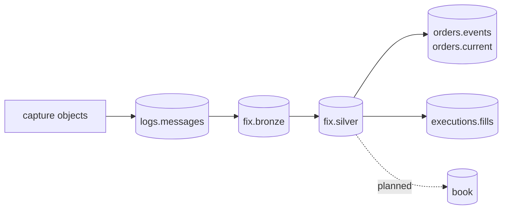

# Data products

rekep publishes three Iceberg tables, and these are the contracts a reader
reviews: the raw lines, the parsed events, and the walked events. Every later
product starts from `fix.silver`, never from `fix.bronze` and never by
reparsing source files.



The order and execution tables are the first cut of the
[roadmap](../roadmap/index.md)'s products, derived in SQL by the dbt project
[`build_dbt`](../pipeline/tasks/build-dbt.md) runs. Their shape is the model's
own configuration rather than a reviewed `Field` declaration, which is what
the three tables below have and the gate the roadmap still holds them to.

| product | row grain | key | purpose |
| --- | --- | --- | --- |
| [`logs.messages`](message.md) | one physical source line | `currhashcode` | exact replayable capture record |
| [`fix.bronze`](fixmsg.md) | one parsed event, however many lines stated it | `curruuid` | the parse's answer, no chain |
| [`fix.silver`](fixmsg.md) | one walked event, identities settled at lifecycle time | `curruuid` | the chain filled, what the products read |

All three are laid out by the hour of `currunix` alone -- on a raw row the
instant the read settled over the line, on a FIX row the one the event settled
on -- so what tells them apart is the key above and not the layout. Only
`logs.messages` keeps `body`, and its `currhashcode` is the line's own code
rather than the event's the two FIX tables carry. A FIX row names raw lines
only through `srcuuids`, and adds the event's `curruuid`, its normalized
identifiers, message direction, and parsed or residual facts.

## Read products

```python
from rekep.iceberg import IcebergCatalog

store = IcebergCatalog.from_dict(
    {
        "name": "rekep",
        "properties": {
            "type": "sql",
            "uri": "sqlite:///data/catalog.db",
            "warehouse": "data/warehouse",
        },
    }
)
messages = store.dataset("logs.messages").read_arrow_table()
fixed = store.dataset("fix.silver").read_arrow_table()
store.close()
```

## Join and audit

```python
import pyarrow
import pyarrow.compute

audit = fixed.select(["curruuid", "srcuuids"])
parents = pyarrow.compute.list_parent_indices(audit.column("srcuuids"))
audit = pyarrow.table(
    {
        "fixuuid": pyarrow.compute.take(audit.column("curruuid"), parents),
        "lineuuid": pyarrow.compute.list_flatten(audit.column("srcuuids")),
    }
)
lines = messages.select(
    ["curruuid", "sourceurl", "rownum", "currhashcode"]
).rename_columns(
    ["lineuuid", "sourceurl", "rownum", "currhashcode"]
)
joined = audit.join(lines, keys="lineuuid", join_type="left outer")

assert joined.num_rows == fixed.num_rows
assert joined.column("currhashcode").null_count == 0
```

The audit projects before it joins: a join carries no map or list column, and
a FIX row has both -- `srcuuids` among them, which is why its entries are
flattened to one provenance row each. The join is exact provenance rather than a recomputation:
`srcuuids` contains identities the raw read stamped on source lines, carried
through the parse and moved by no walk. Capture location and bytes come only
from the joined raw row.

The line's `currhashcode` is an exact-byte identity and `curruuid` is a
settled-event identity: sixteen ordered bytes over the message's settled
instant and its named content. The roadmap uses both: source corrections track
the former; protocol deduplication and downstream event identity use the
latter.
