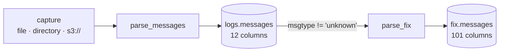

# Two tables

rekep publishes two Iceberg tables. One keeps the line exactly as it was
captured; the other keeps what the FIX frame inside it said.



| | [`logs.messages`](message.md) | [`fix.messages`](fix-message.md) |
| --- | --- | --- |
| one row is | one physical line | one FIX frame |
| body | stored, never parsed | parsed into typed columns |
| columns | 12 | 101 |
| schema fixed by | `Message` | the tag projection, typed by the dictionary |
| key | `(url, rownum)` | `(url, rownum)` |
| partition | `timepartition`, hourly | `timepartition`, hourly |
| written by | `parse_messages` | `parse_fix` |
| contract | [`schemas/rekep/message.json`](https://github.com/Platob/yggfin/blob/main/schemas/rekep/message.json) | [`schemas/rekep/fix-message.json`](https://github.com/Platob/yggfin/blob/main/schemas/rekep/fix-message.json) |

Both merge on their key, so replaying a capture reads every row, writes none,
and creates no snapshot.

## Read either one

```python
from rekep.iceberg import IcebergCatalog

catalog = {
    "name": "rekep",
    "properties": {
        "type": "sql",
        "uri": "sqlite:///data/catalog.db",
        "warehouse": "data/warehouse",
    },
}
store = IcebergCatalog.from_dict(catalog)
messages = store.dataset("logs.messages").read_arrow_table()
fixes = store.dataset("fix.messages").read_arrow_table()
store.close()
```

## The join between them

`fix.messages` carries the raw record's own columns forward, so the two tables
join on the key they share -- and rarely need to, since the FIX row already
holds the line it came from.

```python
import pyarrow

joined = fixes.join(messages, keys=["url", "rownum"], right_suffix="_raw")
assert pyarrow.compute.all(
    pyarrow.compute.equal(joined.column("msghash"), joined.column("msghash_raw"))
).as_py()
```

Two columns are renamed on the way in, because the FIX reader reads five of a
capture's own column names as per-row parameters:

| raw column | in `fix.messages` | why |
| --- | --- | --- |
| `branch` | `logbranch` | on a raw record this is the driver that printed the line, not a FIX dialect |
| `msgdirection` | `direction` | this *is* a reader parameter, so the reading already made is the one used |
