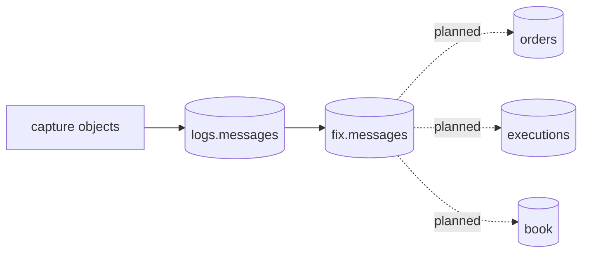

# Data products

rekep currently publishes two immutable-grain Iceberg products. Every later
product starts from `fix.messages`, never by reparsing source files.



| product | row grain | key | purpose |
| --- | --- | --- | --- |
| [`logs.messages`](message.md) | one physical source line | `(sourceurl, rownum)` | exact replayable capture record |
| [`fix.messages`](fix-message.md) | one message that line carried | `(sourceurl, rownum, msghash)` | typed protocol record plus its lossless arrival record |

Both tables are partitioned by the UTC hour derived from the capture
timestamp. Both keep the raw `body` and `bodyhash`; the FIX table additionally
has `msghash`, normalized identifiers, message direction, and every parsed or
unmapped pair.

## Read products

```python
from rekep.iceberg import IcebergCatalog

store = IcebergCatalog.from_dict(
    {
        "name": "rekep",
        "properties": {
            "type": "sql",
            "uri": "sqlite:///data/catalog.db",
            "warehouse": "data/warehouse",
        },
    }
)
messages = store.dataset("logs.messages").read_arrow_table()
fixed = store.dataset("fix.messages").read_arrow_table()
store.close()
```

## Join and audit

```python
audit = fixed.select(["sourceurl", "rownum", "msghash", "bodyhash"])
joined = audit.join(messages, keys=["sourceurl", "rownum"], right_suffix="_raw")
assert joined.column("bodyhash").equals(joined.column("bodyhash_raw"))
```

The audit projects before it joins: a join carries no map or list column, and
a FIX row has both.

`bodyhash` is an exact-byte identity and `msghash` is a parsed-message
identity: sixteen ordered bytes over the message's settled instant and its
named content. The roadmap uses both: source corrections track the former;
protocol deduplication and downstream event identity use the latter.
