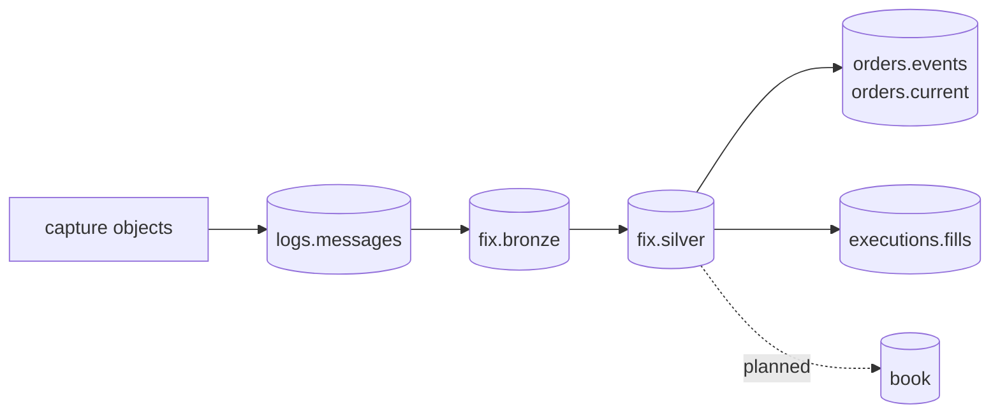

# Data products

rekep publishes three Iceberg tables, and these are the contracts a reader
reviews: the raw lines, the parsed events, and the walked events. Every later
product starts from `fix.silver`, never from `fix.bronze` and never by
reparsing source files.



The order and execution tables are the first cut of the
[roadmap](../roadmap/index.md)'s products, derived in SQL by the dbt project
[`build_dbt`](../pipeline/tasks/build-dbt.md) runs. Their shape is the model's
own configuration rather than a reviewed `Field` declaration, which is what
the three tables below have and the gate the roadmap still holds them to.

| product | row grain | key | purpose |
| --- | --- | --- | --- |
| [`logs.messages`](message.md) | one physical source line | `currhashcode` | exact replayable capture record |
| [`fix.bronze`](fix-message.md) | one parsed event, however many lines stated it | `curruuid` | the parse's answer, no chain |
| [`fix.silver`](fix-message.md) | one walked event, the same identities restated | `curruuid` | the chain filled, what the products read |

`logs.messages` is partitioned by the hour of the capture clock,
`timepartition`; the two FIX tables by the hour of the event's own instant,
`currunix`. Only `logs.messages` keeps `body`, and its `currhashcode` is the
line's own code rather than the event's the two FIX tables carry. A FIX row
names the line it was read from with `sourceurl`, `rownum` and `srcuuids`, and
adds the event's `curruuid`, its normalized identifiers, message direction,
and every parsed or unmapped pair.

## Read products

```python
from rekep.iceberg import IcebergCatalog

store = IcebergCatalog.from_dict(
    {
        "name": "rekep",
        "properties": {
            "type": "sql",
            "uri": "sqlite:///data/catalog.db",
            "warehouse": "data/warehouse",
        },
    }
)
messages = store.dataset("logs.messages").read_arrow_table()
fixed = store.dataset("fix.silver").read_arrow_table()
store.close()
```

## Join and audit

```python
import pyarrow.compute

audit = fixed.select(["sourceurl", "rownum", "curruuid", "srcuuids"])
# The one entry of `srcuuids` is the stored line's own `curruuid`.
audit = audit.append_column(
    "lineuuid", pyarrow.compute.list_element(audit.column("srcuuids"), 0)
)
lines = messages.select(["curruuid", "currhashcode"]).rename_columns(
    ["lineuuid", "currhashcode"]
)
joined = audit.drop_columns(["srcuuids"]).join(lines, keys="lineuuid", join_type="left outer")

assert joined.num_rows == fixed.num_rows
assert joined.column("currhashcode").null_count == 0
```

The audit projects before it joins: a join carries no map or list column, and
a FIX row has both -- `srcuuids` among them, which is why its one entry is
lifted out first. The join is exact provenance rather than a recomputation:
`srcuuids` is the identity the read stamped the line with, carried through the
parse and moved by no walk, and a FIX row holds none of the bytes a line's
code is read over.

The line's `currhashcode` is an exact-byte identity and `curruuid` is a
settled-event identity: sixteen ordered bytes over the message's settled
instant and its named content. The roadmap uses both: source corrections track
the former; protocol deduplication and downstream event identity use the
latter.
