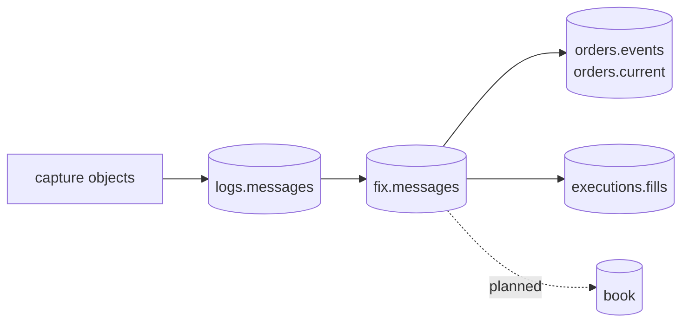

# Data products

rekep publishes two immutable-grain Iceberg products, and these are the two
contracts a reader reviews. Every later product starts from `fix.messages`,
never by reparsing source files.



The order and execution tables are the first cut of the
[roadmap](../roadmap/index.md)'s products, derived in SQL by the dbt project
[`build_dbt`](../pipeline/tasks/build-dbt.md) runs. Their shape is the model's
own configuration rather than a reviewed `Field` declaration, which is what
the two products below have and the gate the roadmap still holds them to.

| product | row grain | key | purpose |
| --- | --- | --- | --- |
| [`logs.messages`](message.md) | one physical source line | `bodyhash` | exact replayable capture record |
| [`fix.messages`](fix-message.md) | one settled event, however many lines stated it | `curruuid` | typed protocol record plus its lossless arrival record |

`logs.messages` is partitioned by the UTC hour of the capture clock and
`fix.messages` by the hour the event happened in. Only `logs.messages` keeps
the raw `body` and its `bodyhash`: both are a line's, and a FIX row is an
event's, so it names the line it was read from with `sourceurl` and `rownum`
and carries `curruuid`, normalized identifiers, message direction, and every
parsed or unmapped pair.

## Read products

```python
from rekep.iceberg import IcebergCatalog

store = IcebergCatalog.from_dict(
    {
        "name": "rekep",
        "properties": {
            "type": "sql",
            "uri": "sqlite:///data/catalog.db",
            "warehouse": "data/warehouse",
        },
    }
)
messages = store.dataset("logs.messages").read_arrow_table()
fixed = store.dataset("fix.messages").read_arrow_table()
store.close()
```

## Join and audit

```python
audit = fixed.select(["sourceurl", "rownum", "curruuid"])
joined = audit.join(messages, keys=["sourceurl", "rownum"])
assert joined.column("bodyhash").null_count == 0
```

The audit projects before it joins: a join carries no map or list column, and
a FIX row has both. `(sourceurl, rownum)` is what a FIX row names its line
with -- the bytes and their digest are `logs.messages`' -- and it resolves to
one stored line. An event restated at several hops keeps the first arrival's
position, so the join reaches that line and the others stay in
`logs.messages`.

`bodyhash` is an exact-byte identity and `curruuid` is a settled-event
identity: sixteen ordered bytes over the message's settled instant and its
named content. The roadmap uses both: source corrections track the former;
protocol deduplication and downstream event identity use the latter.
