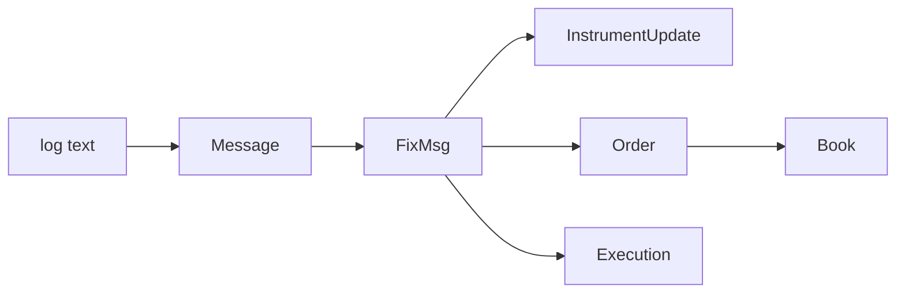

# Products

Six persisted contracts. A row is text until the FIX registry transcribes it,
and a market product until a fold gives it state.



| product | one row is | built by |
| --- | --- | --- |
| [Message](message.md) | one log line, tokenized | `Message.from_text` |
| [FixMsg](fixmsg.md) | one line transcribed under the registry | `FixMsg.from_message_batch` |
| [Instrument update](instrument.md) | one current reference-data event | `InstrumentUpdate.from_fixmsgs` |
| [Order](order.md) | one version of one order | `FixMsg.into_market_events` |
| [Execution](execution.md) | one fill, correction or cancellation | `FixMsg.into_market_events` |
| [Book](book.md) | both sides of one book, flat | `BookIterator.from_events` |

Every event product is keyed `(unix, hash)` except `InstrumentUpdate`, whose
current row is keyed by its sixteen-byte `xhash`. All lifecycle and reference
identities are clock-free `int64` values. All six are sorted by `hash` and
partitioned on `unixpartition` alone:

```bash
rekep fields load --target schemas/rekep/order.yaml | tail -2
```

```text
  primary keys: ['unix', 'hash']
  partition keys: {'unixpartition': 'identity'}
```

Declarations are dumped from the classes, so a document is never the contract:

```bash
rekep fields dump --pyclass rekep.market.orders:Order --target schemas/rekep/order.yaml
```

See [schema contracts](../contracts/index.md) for the document format,
[types](../contracts/types.md) for the Arrow types it may name, and
[binary identities](../contracts/identity.md) for the lifecycle and event hash contracts.
