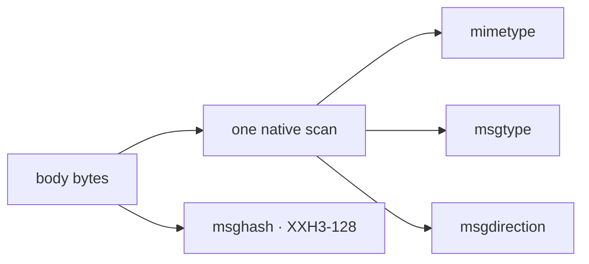

# logs.messages

One row is one physical text record: where it came from, what the log header
said, what the body *is*, and the exact bytes. The body is never interpreted
here.

## Schema

12 columns, `(url, rownum)` primary key, partitioned by `timepartition` hour.

| column | type | null | role |
| --- | --- | --- | --- |
| `url` | `string` | no | primary key -- the source object's URI |
| `rownum` | `int64` | no | primary key -- 1-based physical row in that object |
| `timestamp` | `timestamp[us, UTC]` | yes | header clock; an offset-free header reads as UTC |
| `timepartition` | `timestamp[us, UTC]` | yes | derived from `timestamp`; Iceberg `hour` transform |
| `threadname` | `string` | yes | header capture |
| `branch` | `string` | yes | header capture -- the driver that printed the line |
| `level` | `string` | yes | header capture |
| `mimetype` | `string` | no | media type inferred for the body |
| `msgtype` | `string` | no | `MsgType` the frame spells, else `unknown` |
| `msgdirection` | `string` | no | `SENT`, `RECV`, else `unknown` |
| `msghash` | `fixed_size_binary[16]` | yes | XXH3-128 digest holder over `body` |
| `body` | `binary` | no | bytes after the matched header prefix |

```python
from rekep import Message

field = Message.field()
assert [member.name for member in field][:4] == [
    "url",
    "rownum",
    "timestamp",
    "timepartition",
]
assert field["msghash"].digest.sources == ["body"]
assert field["msghash"].digest.algorithm == "xxh3-128"
assert field["timepartition"].partition.sources == ["timestamp"]
assert field["msgtype"].nullable is False
```

## One record

```python
import datetime

from rekep import Message

row = Message.from_text(
    b"8=FIX.4.4|35=D|11=C1|10=000",
    url="s3://logs/capture.log.gz",
    rownum=17,
    timestamp="2026-01-01 10:00:00.123_456",
    threadname="reader",
    branch="venue",
    level="INFO",
)

assert row.body == b"8=FIX.4.4|35=D|11=C1|10=000"
assert (row.url, row.rownum) == ("s3://logs/capture.log.gz", 17)
assert row.timestamp == datetime.datetime(2026, 1, 1, 10, 0, 0, 123456, tzinfo=datetime.UTC)
```

## Classification without interpretation



`classify_arrow_array` answers all three in one pass over the payload column --
the same shallow scan and the same direction verbs the FIX reader itself uses,
so the classifying stage and the parsing one cannot disagree.

```python
import pyarrow
from yggdryl.fix import classify_arrow_array

column = pyarrow.array([b"sending >> 8=FIX.4.4|35=D|55=TTF|10=000|", b"heartbeat scheduled"])
mimetype, msgtype, msgdirection = classify_arrow_array(column, "sent")

assert mimetype.to_pylist() == ["text/fix", "application/octet-stream"]
assert msgtype.to_pylist() == ["D", None]
assert msgdirection.to_pylist() == ["SENT", "SENT"]
```

The three columns are non-null in the table: the line that named no `MsgType`
stores `unknown`, which is exactly the predicate `parse_fix` filters on.

`direction` is the task parameter naming what an *unmarked* line took. A
session's own log is written by the side doing the sending, so `sent` is the
default; a capture taken from the other side sets `recv`, and one whose silence
means nothing sets `unknown`. Any verb a line carries beats it.

`msghash` digests the exact body bytes rather than the parsed message, so a
record is identified by what arrived, not by how it was numbered.
[Quality](../fix/quality.md) says when each digest is the right key.

## Source

```json
{
  "parameters": {
    "filesystem": "file:data/capture"
  }
}
```

| spelling | reaches |
| --- | --- |
| `file:data/capture` | a relative path, file or directory |
| `/var/log/session` | an absolute path |
| `s3://bucket/capture?region=eu-west-1` | S3, with `endpoint_override`, `scheme` and `force_path_style` for a compatible endpoint |

The URI is bound with `IOBase.from_uri`. Recursive discovery, decompression by
suffix, header capture and physical-line batching happen before the first
`RecordBatch`; this boundary only normalizes a matched timestamp to UTC
microseconds.
