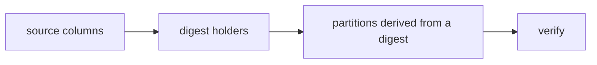

# Native Arrow apply

Every rekep boundary goes through one apply
([Field contract](../contracts/types.md)). Four things it does not do yet.

## Declarations below a nested container

`AppliedPlan::compile` rejects executable `partition:` or `digest:` metadata
below a list, map, union, dictionary or run-end container until the protocol
walkers can materialize those locations. Refusing is the current answer;
supporting them is the work.

## Strict nulls, in the right order

In strict mode only the target field's *initial* missing/null refusal is
deferred. Source nulls are never replaced with canonical defaults before
whole-column materialization decides to preserve a populated column -- so final
verification is what rejects a remaining required null.

## One plan, fewer passes

| change | effect |
| --- | --- |
| fuse `AppliedReader` on its first source, protocol or verification error, dropping the inner stream then | a failed stream stops holding its input |
| eager `Field.apply_arrow_table` over one compiled plan | the table helper stops rebuilding a plan per call |
| disable partition and digest walks when no such namespace is in the schema | a no-protocol apply costs what a strict cast costs |
| consume dependency-only input columns while emitting exactly the target schema | consumers stop writing projection closures |

Malformed partial declarations are still rejected while those walks are
disabled -- skipping the walk is not skipping validation.

## A dependency graph, not field order

Generated fields are ordered by their dependency graph: a partition derived
from a digest holder must see that digest produced in the same apply. Cycles
are rejected at plan construction rather than leaving a generated null or
depending on declaration order.

A derived transform accepts typed literal arguments, so
`truncate(timestamp, "hour")` can materialize a UTC hour boundary. Unary tokens
stay canonical, and the expression compiles once per reader.

## Proof

Complete nested error paths, partial generated nulls, populated generated
columns, malformed protocols, schema-only failure, lazy pull-time errors, early
release, and one-plan reuse.

Benchmark 1, 10 and 1,000 small batches with and without protocol metadata,
after asserting identical output. **A no-protocol apply must be
indistinguishable from the strict cast path within noise.**
