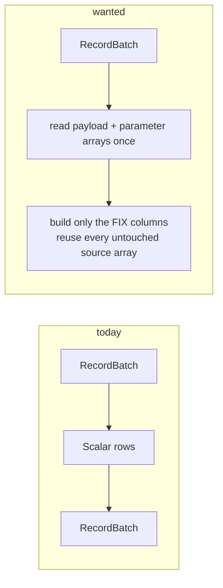

# Column-native FIX parsing

The reader landed: `parse_arrow_reader` over `FixBatchReader::from_column` is
the runtime path [`parse_fix`](../pipeline/tasks/parse-fix.md) uses, and there
is one parser. What is still open is how it moves a batch.



The round trip through `Scalar` rows is what makes the cost scale with
**carried** bytes instead of **parsed** columns -- a 32-column capture pays for
its 32 columns on every row, whether or not the frame touches them.

## What changes

| | |
| --- | --- |
| resolve | the payload and optional parameter arrays once, from the source schema |
| read | binary and UTF-8 values directly |
| build | only the native FIX columns |
| reuse | every untouched source array; zero-copy slices when output bounds split a source batch |
| retain | at most one source batch and one output batch |

The no-dedup path becomes allocation-independent of the number and width of
carried source columns. With `dedup=true`, only selected row indexes are
retained and Arrow `take` is applied once per emitted slice -- source values
are never rebuilt through `Scalar`.

A source error yields any completed prefix once, then the same error, then
fuses. Closing the output releases the input immediately.

## What must not change

```text
source-first schema        child metadata          collision refusal
the branch parameter       row-in/row-out default  malformed-row behavior
bounds                     laziness                error fusion
```

And no second FIX parser or batch type.

## Proof

Exact parity with the current reader for binary and UTF-8 payloads, mixed
valid and prose rows, every parameter column, nulls, empty input, 1 and 65,536
row bounds, byte bounds, max rows, dedup across source-batch boundaries,
collisions and pull-time errors. Assert buffer identity for unsplit carried
arrays, and shared buffers for slices.

Benchmark release builds after checking identical batches: 1, 1,024 and 65,536
row source batches; narrow and 32-column captures; binary and UTF-8 bodies;
dedup off and on. Report rows/s, first-batch latency, peak retained bytes and
allocations per row.

**Reject a narrow no-dedup regression, and require wide-source cost to scale
with parsed columns rather than carried bytes.**
