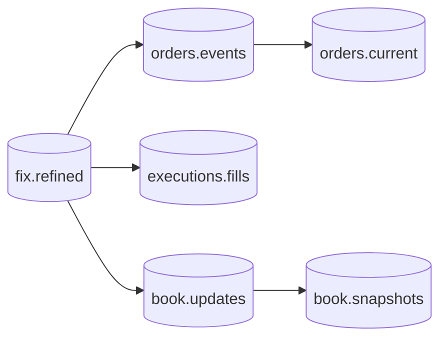

# Data-product roadmap

The ingestion foundation is complete when `fix.refined` is replayable,
typed, auditable, and deployable. The next work is not another parser layer;
it is a sequence of business products derived from the walked rows.

| order | product | grain | main consumer | status |
| ---: | --- | --- | --- | --- |
| 1 | [`orders.events`](orders.md) | one normalized order event | lifecycle audit and state reconstruction | first cut in dbt |
| 2 | [`orders.current`](orders.md#orderscurrent) | latest settled state per logical order | operations and exposure views | first cut in dbt |
| 3 | [`executions.fills`](executions.md) | one economic fill/correction/cancel | trading, allocation, and TCA | first cut in dbt |
| 4 | [`book.updates`](order-book.md) | one normalized depth mutation | market-data replay | planned |
| 5 | [`book.snapshots`](order-book.md#booksnapshots) | one ordered book image at a checkpoint | research and monitoring | planned |

The first three are published today by the
[dbt project](../pipeline/dbt.md) under `data/dbt`: the grains, keys, identity
precedence and state rules below are what its models implement, and the page
lists where the SQL projection of them differs from the schemas here. They are
a first cut and not the gate: a product passes the gates below when its shape
is a `Field` declaration with a reviewed snapshot beside it, which is still
what these pages specify.

## Rules shared by every product

1. Read `fix.refined` as a `RecordBatchReader`; never re-open captures, and
   never `fix.raw`, which carries no chain.
2. Retain `srcuuids` and `curruuid` as source lineage; resolve capture
   location by joining `srcuuids` to `logs.messages.curruuid`.
3. Make the row grain and key explicit before adding columns.
4. Keep stated protocol values separate from derived identities or state.
5. Preserve corrections, cancels, rejects, and unknown states as events; do
   not rewrite history in place.
6. Build current-state or snapshot products from immutable events.
7. Publish a `Field` schema, Iceberg key, partition, replay test, and source
   coverage report together.

## Build gates

Each product lands only when it has:

| gate | requirement |
| --- | --- |
| grain | one sentence that decides whether a source message emits zero, one, or many rows |
| identity | deterministic key across replay and capture duplication |
| lineage | source line identities and parsed digest retained |
| semantics | precedence for identifiers, clocks, corrections, and nulls |
| schema | metadata-bearing field plus reviewed JSON snapshot |
| quality | unmapped/rejected counters and reconciliation queries |
| storage | partition, sort intent, create/append/overwrite behavior |
| integration | fixture from capture through the product and idempotent replay |

The order and execution products come first because the current fixed schema
already projects their identifiers, quantities, prices, state, clocks, and
parties. Order-book products follow after the registry projection includes the
market-data repeating groups needed to express depth without consulting
residual `fixentries` in normal queries.
