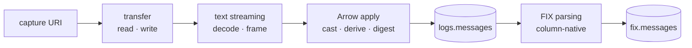

# Roadmap

Work the pipeline is waiting on, and what changes for it when each lands. Every
item is in the native core below rekep -- none of it adds a second
implementation here.

| item | status | what it unblocks here |
| --- | --- | --- |
| [Compressed text streaming](text-streaming.md) | open | concatenated gzip members, and a byte bound that never rewrites a body |
| [Transfer bottlenecks](transfer.md) | open | whole-object reads and writes that do not buy memory proportional to the object |
| [Native Arrow apply](arrow-apply.md) | open | derived and digest columns below nested containers, and a no-protocol path as fast as a plain cast |
| [Column-native FIX parsing](fix-throughput.md) | open | `parse_fix` cost scaling with parsed columns rather than carried bytes |
| FIX schema and registry JSON | **landed** | the checked [`fix.messages` snapshot](../products/fix-message.md) and the [`config/fix` dictionary](../fix/index.md#registry-used-by-the-task) |

## What every item shares

| rule | why |
| --- | --- |
| Rust first, thin bindings after | one implementation, reachable from every language |
| no compatibility surface | a second path is a second thing to keep correct |
| output verified before timing | a benchmark on wrong output measures nothing |
| a stated regression threshold | "faster" is not a result; a number is |
