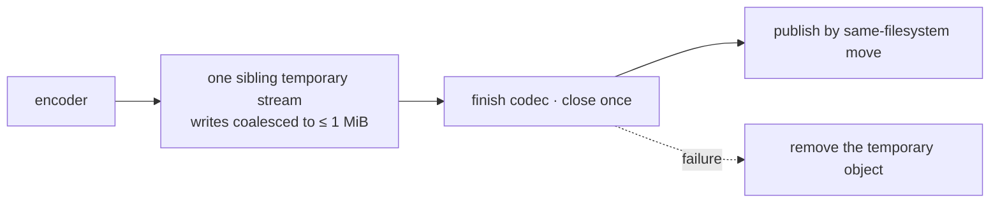

# Transfer bottlenecks

Reads and writes that buy memory proportional to the object, or one filesystem
call per encoded block. Neither shows up on a 14-line fixture and both show up
on a day's capture.

## Writes: one output transaction

Today every encoder write and every 64 KiB decoded block calls `pwrite`, which
costs a metadata lookup plus open/write/close.

| rule | why |
| --- | --- |
| publish by move, using the backend's documented guarantee | an object-store move is not atomic unless the backend says so |
| preserve the old target only where replace-on-success is guaranteed | otherwise document and test the weaker post-failure state |
| the bounded fallback only when no bound location exists | and state that rollback is then unbounded |
| never emulate a stream with repeated `pwrite` | that is the bottleneck being removed |

`compress_into_with_level` and `decompress_into_with` route through it first;
then structured JSON/YAML/TOML, text, IPC, Parquet and Avro record overwrites,
each of which accumulates a complete encoded object in memory today. The Python
Arrow sink coalesces before `PyOutputStream.write`, or streaming trades one
full-object copy for excessive GIL calls.

Compressed text append must stop decoding and re-encoding the whole old object
in memory: a bounded transactional rewrite first, then appending a gzip member
or zstd frame once [concatenated streams](text-streaming.md) land, keeping the
exact separator. Rewrite stays for codecs and backends with no valid append
contract.

## Reads: one open, one window

| path | today | wanted |
| --- | --- | --- |
| `read_all_bytes` | a vector per 64 KiB item, copied into a growing vector, copied again into `PyBytes` | one sequential open, one reusable window, fewest safe copies |
| Python Arrow readers | `read → Vec → copy` | a `readinto`/buffer-protocol fast path, `read` kept for arbitrary `PyFileSystem` |
| `Buffered` over a large object | one inner open per 64 KiB page past its budget | bypass the cache, or populate only a fitting working set |
| explicit `IOBase.open()` | reopens on every `pread` | retain one random-access reader until `close()` |

A metadata size may reserve but never define correctness: absent, unknown,
growing, shrinking, short-read and close-failure sources all have to pass. An
exported mutable buffer is never retained after the synchronous call.
One-pass text reads stay out from behind `Buffered` -- they already hold one
leaf stream under a 1 MiB `BufReader`.

## The measured baseline

64 MiB cached reads, release build, PyArrow 25.0.1:

| path | median |
| --- | ---: |
| pathlib / PyArrow | 1.6-1.8 GiB/s |
| `IOBase.open_input_file().read()` | 1.5-1.7 GiB/s |
| `IOBase.read_bytes` | 0.37 GiB/s |
| default `Buffered`, object over its 8 MiB budget | ~0.04 GiB/s |

`IOBase.open_input_file().read()` already matches direct PyArrow, and
`write_bytes` at 64 MiB is within ~20% of it -- both are the controls.

## Proof

Counting Rust filesystems plus `LocalFileSystem`, native-delegate
`PyFileSystem`, and fsspec `PyFileSystem`. Bytes and records compared against
the old implementation *before* timing. Cover 0/1/short/1 MiB/64 MiB values,
partial reads and writes, source growth and shrink, error after a prefix, a
missing `readinto`, early drop, explicit open/close, and codec-finish failure.

Assert one open and close per sequential operation, no call larger than 1 MiB,
temporary cleanup, the temporary stream receiving bytes before the final input
batch is pulled, and publication only after the encoder finishes. Seven
interleaved warmed samples reporting median and range throughput, calls,
first-batch latency and peak retained bytes.

**Reject** a whole-read regression, a text-read regression above 5%, any
sequential reopen amplification, or record-write memory proportional to total
input size.
